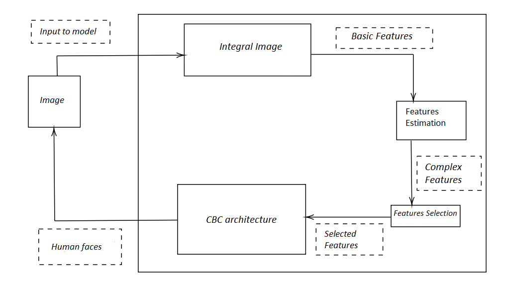
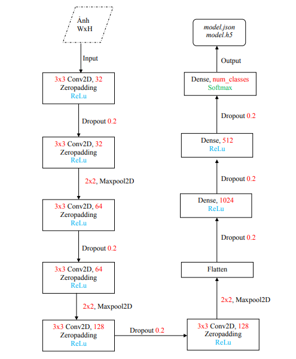

# deep-face
Human face recognition is one of the most familiar problems recently with a lot of
approaches as well as efficient algorithms. The method an author uses to build a useful
system for helping users in their attendance management process and increasing the
accuracy and speed.

In this project, the author manipulates some techniques which allow extracting facial
image in pictures based on Cascade of Boosted Classifiers of OpenCV library and the
computation technique of Convolution Neural-Network to identify the object in the
images with an accuracy 98:84% (3456 pictures of 18 different people). The HumanFace Recognition application built in Client and Fat-Server architecture, fine-tuned to
meet real-time requirements (objects do not need to stop).

## Detection architecture
Haar-like and CBC:

 

## Recognition architecture
CNN - 10 blocks:

 

## ATTENTION!!!
* The dataset in this project represents only a small part of real-world
* An accuracy is just a number receives in a perfect environment
* CNN need the dataset more popular: Has a lot of pictures represent for each object. Each object needs "good pictures" such as lighting conditions, the position of faces in an image,...
* If you had good-dataset, you could implement them very well or else you would get a poor-result.

